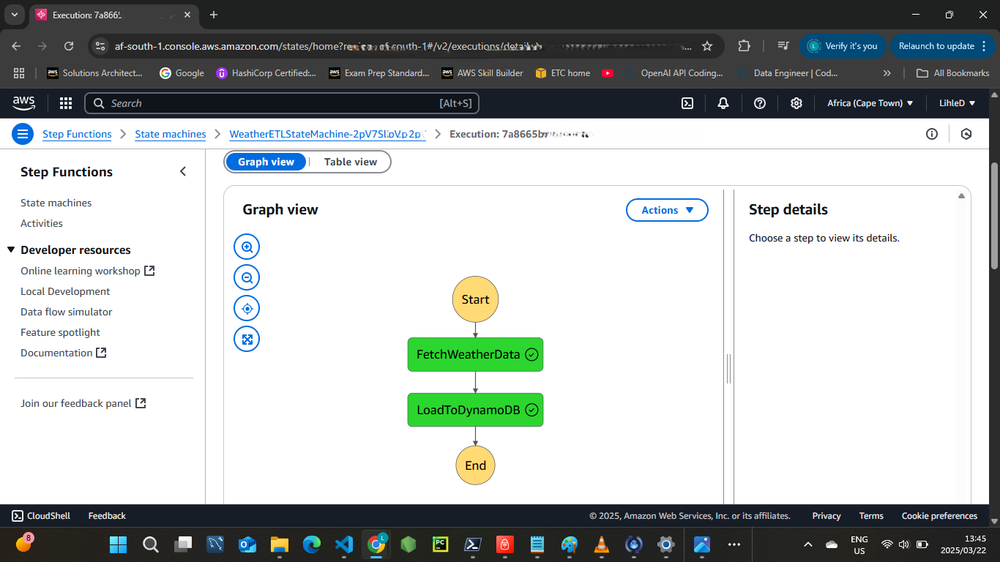
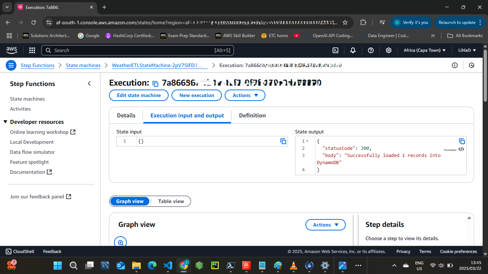
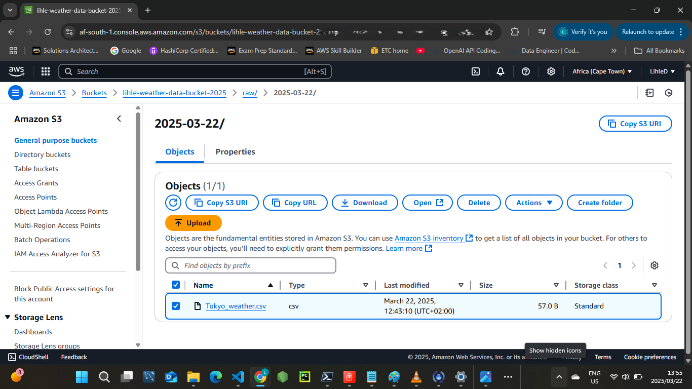

# Serverless Weather ETL Pipeline

This project is a serverless Extract, Transform, Load (ETL) pipeline built using AWS Serverless Application Model (SAM). It fetches daily weather data for Tokyo from the OpenWeatherMap API, stores it as a CSV file in Amazon S3, and loads the data into Amazon DynamoDB. The pipeline is triggered daily using a CloudWatch Events rule and orchestrated by AWS Step Functions. The stack was successfully tested on March 22, 2025, and then deleted to avoid costs.

## Project Architecture

- **AWS CloudWatch Events**: Triggers the pipeline daily with a `rate(1 day)` schedule.
- **AWS Step Functions**: Orchestrates two Lambda functions:
  - **FetchWeatherData**: Queries the OpenWeatherMap API for Tokyo’s weather (temperature and humidity), saves it as a CSV in S3, and passes the file location to the next step.
  - **LoadToDynamoDB**: Reads the CSV from S3 and loads the data into DynamoDB.
- **Amazon S3**: Stores raw CSV files (e.g., `lihle-weather-data-bucket-2025/raw/YYYY-MM-DD/Tokyo_weather.csv`).
- **Amazon DynamoDB**: Stores processed weather data in the `WeatherRecords` table with a composite key (`city` and `date`).


## Project Structure


├── FetchWeatherData/
│   ├── FetchWeatherData.py    # Fetches and saves weather data
│   └── requirements.txt       # Dependencies: requests, pandas
├── LoadToDynamoDB/
│   ├── LoadToDynamoDB.py      # Loads data into DynamoDB
│   └── requirements.txt       # Dependency: pandas
├── template.yaml              # SAM template defining AWS resources
└── README.md                  # This documentation file


## Screenshots and Results

The pipeline was tested successfully before deletion. Below are key visuals and execution details from the test run:

- **Step Functions Execution**: Shows the successful run of both steps in the pipeline.
  
- **Step Functions Output**: Confirms one record was processed successfully.
  
- **S3 Bucket**: Displays the stored CSV file from FetchWeatherData.
  

### Execution Details
- **State Machine Definition**: Defines the workflow executed during testing.
  ```json
  {
    "StartAt": "FetchWeatherData",
    "States": {
      "FetchWeatherData": {
        "Next": "LoadToDynamoDB",
        "Resource": "arn:aws:lambda:af-south-1:203918881738:function:WeatherETLPipeline-FetchWeatherDataFunction-VvOwMS7aZkZB",
        "ResultPath": "$.fetchResult",
        "Type": "Task"
      },
      "LoadToDynamoDB": {
        "End": true,
        "Parameters": {
          "bucket.$": "$.fetchResult.bucket",
          "key.$": "$.fetchResult.key"
        },
        "Resource": "arn:aws:lambda:af-south-1:203918881738:function:WeatherETLPipeline-LoadToDynamoDBFunction-4nE9DPdPbkni",
        "Type": "Task"
      }
    }
  }